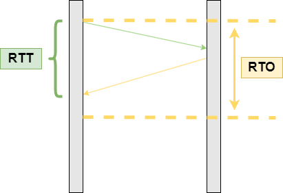
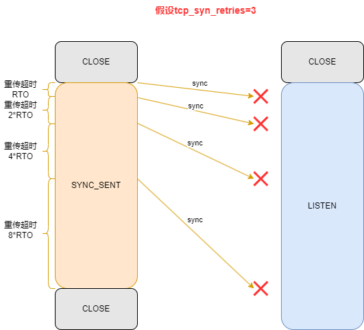
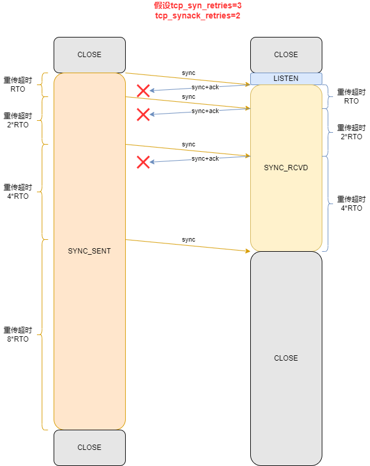
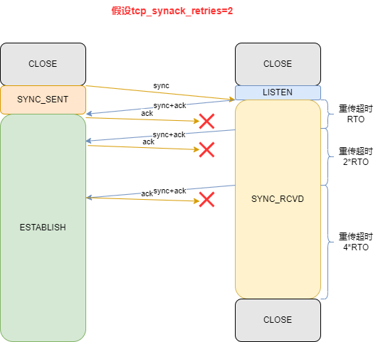
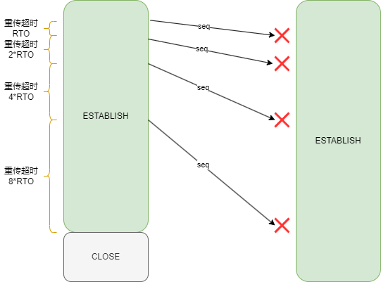
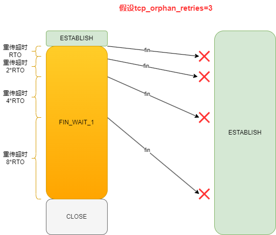
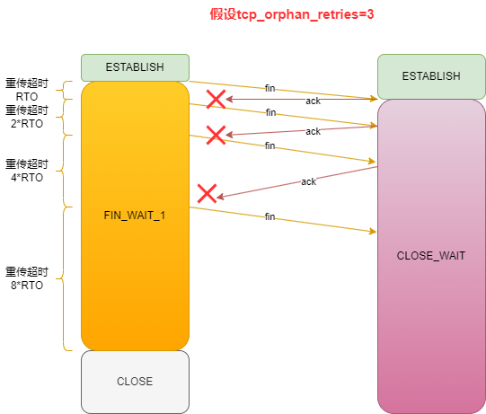
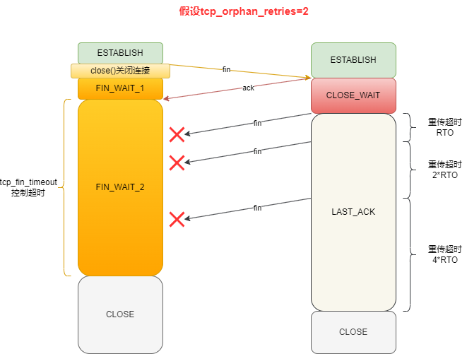
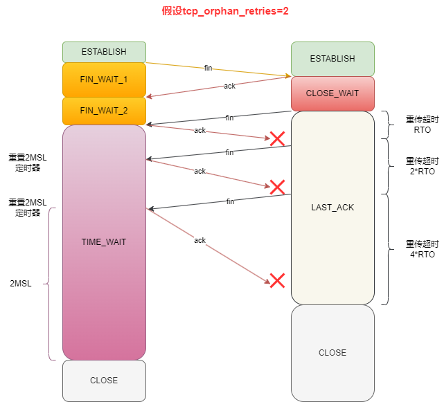

- [rtt和rto](#rtt和rto)
- [3次握手重传超时](#3次握手重传超时)
  - [第一次握手sync丢失](#第一次握手sync丢失)
  - [第二次握手sync+ack丢失](#第二次握手syncack丢失)
  - [第三次握手ack丢失](#第三次握手ack丢失)
- [传输数据重传超时](#传输数据重传超时)
- [4次挥手重传超时](#4次挥手重传超时)
  - [第一次挥手fin丢失](#第一次挥手fin丢失)
  - [第二次挥手ack丢失](#第二次挥手ack丢失)
  - [第三次挥手fin丢失](#第三次挥手fin丢失)
  - [第四次挥手ack丢失](#第四次挥手ack丢失)
- [参考资料](#参考资料)

# rtt和rto

- rtt（Round-Trip Time）：tcp数据包发出到收到ack的往返时延。
- rto（Retransmission Timeout）：超时重传时间。

rto应该略大于rtt。



RFC6289建议使用以下的公式计算rto：

- 首次计算RTO，SRTT为计算平滑的RTT，DevRTT是计算平滑的RTT和最新的RTT的差距

$$\begin{align}
SRTT&=RTT\notag \\
DevRTT&=\frac{RTT}{2}\notag \\
RTO&=\mu*SRTT+\partial*DevRTT\notag \\
\end{align}$$

- 后续计算RTO

$$\begin{align}
SRTT&=RTT+\alpha*(RTT-SRTT)\notag \\
DevRTT&=(1-\beta)*DevRTT+\beta*(\lvert RTT-SRTT\rvert)\notag \\
RTO&=\mu*SRTT+\partial*DevRTT\notag \\
\end{align}$$

在linux下，$\alpha=0.125$，$\beta=0.25$， $\mu=1$，$\partial=4$。

并且在linux中（4.0内核），也定义了RTO的初始值，和最小值200ms和最大值120s。

```c
#define TCP_RTO_MAX ((unsigned)(120*HZ))
#define TCP_RTO_MIN ((unsigned)(HZ/5))
#define TCP_TIMEOUT_INIT ((unsigned)(1*HZ)) /* RFC6298 2.1 initial RTO value    */
#define TCP_TIMEOUT_FALLBACK ((unsigned)(3*HZ)) /* RFC 1122 initial RTO value, now
                  * used as a fallback RTO for the
                  * initial data transmission if no
                  * valid RTT sample has been acquired,
                  * most likely due to retrans in 3WHS.
                  */
```

可以通过`ss`命令查看tcp连接当前的rto值。

```bash
[root@centos ~]# ss -anpti | grep ESTAB -A 1
ESTAB      0      36     192.168.5.16:22                 192.168.5.66:10981               users:(("sshd",pid=14081,fd=3))
	 cubic wscale:8,7 rto:248 rtt:47.822/3.868 ato:59 mss:1460 rcvmss:1460 advmss:1460 cwnd:10 bytes_acked:99925 bytes_received:17974 segs_out:589 segs_in:707 send 2.4Mbps lastsnd:14 lastrcv:15 lastack:131 pacing_rate 4.9Mbps unacked:1 retrans:0/1 rcv_space:29200
```

并且连续的重传超时，超时时间通过指数回退算法计算得到，每次是上一次的2倍。比如初始超时时间是1s，后续连续的重传超时时间为2s，4s，8s，等等。

# 3次握手重传超时

## 第一次握手sync丢失

在linux中，tcp的初始rto是1s（见上节内容），并且sync的重传次数由`tcp_syn_retries`内核参数决定，默认为6，计算可得到总的超时时间为127s。

```bash
[root@centos ~]# sysctl -a | grep tcp_syn_retries
net.ipv4.tcp_syn_retries = 6
[root@centos ~]# cat /proc/sys/net/ipv4/tcp_syn_retries
6
```



## 第二次握手sync+ack丢失

`sync+ack`的重传次数由`tcp_synack_retries`内核参数决定，默认为5。

```bash
[root@centos ~]# sysctl -a | grep tcp_synack_retries
net.ipv4.tcp_synack_retries = 5
[root@centos ~]# cat /proc/sys/net/ipv4/tcp_synack_retries
5
```



## 第三次握手ack丢失



# 传输数据重传超时

tcp数据包的重传次数由`tcp_retries2`内核参数决定，默认为15。

```bash
[root@centos ~]# sysctl -a | grep tcp_retries2
net.ipv4.tcp_retries2 = 15
```



# 4次挥手重传超时

## 第一次挥手fin丢失

主动关闭方的fin包的重传次数由`tcp_orphan_retries`内核参数决定，默认为0，但0其实表示的是使用内核代码中的默认值，为8。

```bash
[root@centos ~]# sysctl -a | grep tcp_orphan_retries
net.ipv4.tcp_orphan_retries = 0
[root@centos ~]# cat /proc/sys/net/ipv4/tcp_orphan_retries 
0
```



## 第二次挥手ack丢失



## 第三次挥手fin丢失

被动关闭方的fin包的重传次数也是由`tcp_orphan_retries`内核参数决定。

对于`close`函数主动关闭的连接，由于无法再发送和接收数据，所以`FIN_WAIT2`状态不可以持续太久，而`tcp_fin_timeout`控制了这个状态下连接的持续时长，默认值是60秒。

如果主动关闭方使用`shutdown`函数关闭连接，如果主动关闭方一直没收到第三次挥手，那么主动关闭方的连接将会一直处于`FIN_WAIT2`状态。



## 第四次挥手ack丢失

当客户端收到服务端的第三次挥手的`FIN`报文后，就会回`ACK`报文，也就是第四次挥手，此时客户端连接进入`TIME_WAIT`状态，`TIME_WAIT`状态会持续`2MSL`后才会进入关闭状态。



# 参考资料

- [30张图解： TCP 重传、滑动窗口、流量控制、拥塞控制发愁](https://zhuanlan.zhihu.com/p/133307545)
- [理解TCP协议的重传时间](https://www.cnblogs.com/mylinuxer/articles/5159476.html)
- [ip-sysctl.txt](https://www.kernel.org/doc/Documentation/networking/ip-sysctl.txt)
- [TCP 三次握手与四次挥手面试题](https://xiaolincoding.com/network/3_tcp/tcp_interview.html#%E7%AC%AC%E4%B8%80%E6%AC%A1%E6%8F%A1%E6%89%8B%E4%B8%A2%E5%A4%B1%E4%BA%86-%E4%BC%9A%E5%8F%91%E7%94%9F%E4%BB%80%E4%B9%88)
