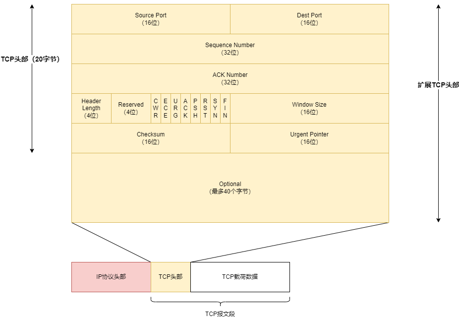
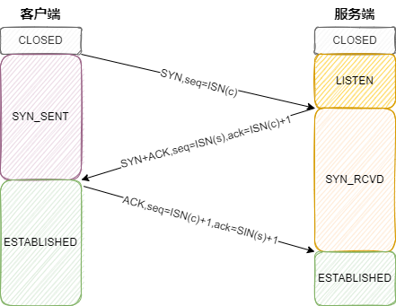
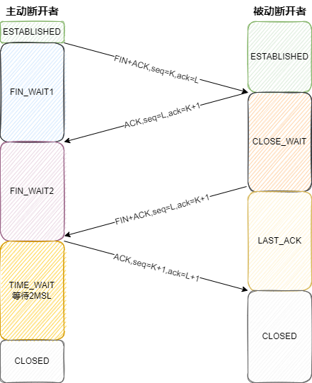
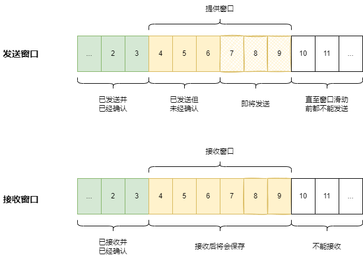

- [tcp报文结构](#tcp报文结构)
  - [初始化序号（ISN）为什么要随机生成](#初始化序号isn为什么要随机生成)
- [三次握手 四次挥手](#三次握手-四次挥手)
  - [服务端listen的参数backlog](#服务端listen的参数backlog)
  - [TIME\_WAIT状态为什么要持续2MSL](#time_wait状态为什么要持续2msl)
- [tcp选项](#tcp选项)
  - [最大段大小（MSS）](#最大段大小mss)
  - [选择确认（SACK）](#选择确认sack)
  - [窗口缩放（WSOPT）](#窗口缩放wsopt)
- [滑动窗口](#滑动窗口)
- [拥塞控制](#拥塞控制)
- [参考资料](#参考资料)

# tcp报文结构

- Source Port：源端口号。
- Dest Port：目的端口号。
- Sequence Number：序列号。用来表示载荷数据中第一个字节的编号。一次tcp连接的初始序列号（Initial Sequence Number ISN）一般都是随机生成的。
- ACK Number：确认号。用于接收方告知发送方下一次期待接受的序列号，也就是自己已经成功接收哪些数据了。
- Header Length：头部长度，单位为4字节，所以最长为60字节，固定的头部大小是20字节，可选的数据最多40字节。
- CWR（Congestion Window Reduce）：拥塞窗口减小，发送方降低它的发送速率。
- ECE（ECN Echo）：ECN回显，ECN就是ip包中的显式拥塞通知，发送方发送一个回显表示自己之前已经收到ECN消息了。
- URG（Ergent）：紧急，紧急指针字段有效，很少使用。
- ACK：确认，确认号有效，在连接建立后的tcp报文中都会开启，就是一边告知自己的序列号，告诉对方自己这次发送了什么，一边告知自己的ACK号，告诉对方自己想要接收什么。
- PSH：推送，接收方应尽快给应用程序传送这个数据，还没被可靠实现。
- RST：重置连接，连接取消，经常是因为错误。
- SYN：用于初始化一个连接的同步序列号。
- FIN：该报文的发送方已经结束向对方发送数据。
- Window Size：滑动窗口大小，用来实现流量控制，窗口越大表示该tcp连接的吞吐量越大。
- Checksum：校验和，会校验tcp头部和数据以及ip头部部分内容。
- Urgent Pointer：紧急指针。

## 初始化序号（ISN）为什么要随机生成

- **防止伪造TCP包**：若初始化序号是静态的，那么容易被伪造，如果是动态变化的，则增加了安全性，起码伪造的序号要在对方的滑动窗口范围之内。
- **防止混淆新的连接和旧的连接的tcp包**：建立一个新的tcp连接之后，网络上可能还有相同地址和端口的旧的tcp连接的包，这样可以一定程度避免混淆数据的情况。

# 三次握手 四次挥手

建立一个tcp连接需要三次握手

- 客户端发送一个SYN报文，里面携带了自己的初始序列号ISN(c)。
- 服务端回应一个SYN+ACK报文，包含了自己的初始化序列号ISN(s)，同时将客户端的初始化序列号ISN(c)+1作为自己的ACK号。
- 为确认服务端的SYN，客户端将ISN(s)+1作为ACK号发送给服务端，自此完成tcp连接。

断开tcp连接需要四次挥手

- 主动关闭者发送一个FIN报文，里面携带自己当前的序列号K表示自己最后的数据，这时候可能对方还没收完之前的数据，这时可以采用快速重传技术对方发送ACK报文，ACK号是之前的，主动关闭者会重传之前的数据。
- 被动关闭者发送ACK报文，ACK号就是K+1表明自己已经成功接收到了主动关闭者发送的FIN报文。
- 被动关闭者变为主动关闭者，向对方发送一个FIN报文，里面携带自己当前的序列号L表示自己最后的数据。
- 最后对方发送一个ACK，ACK号就是L+1，最后完成了连接的断开。

## 服务端listen的参数backlog

在linux 2.2以前:
在底层维护一个由backlog指定大小的队列。服务端收到SYN后，返回一个SYN+ACK，并把连接放入队列中，此时这个连接的状态是SYN_RECEIVED。当客户端返回ACK后，此连接的状态变为ESTABLISHED。队列中只有ESTABLISHED状态的连接能够交由应用处理。第一种实现方式可以简单概括为：一个队列，两种状态。
linux 2.2以后:
在底层维护一个SYN_RECEIVED队列和一个ESTABLISHED队列，当SYN_RECEIVED队列中的连接返回ACK后，将被移动到ESTABLISHED队列中。backlog指的是ESTABLISHED队列的大小。SYN_RECEIVED队列的大小由/proc/sys/net/ipv4/tcp_max_syn_backlog系统参数指定，ESTABLISHED队列由backlog和/proc/sys/net/core/somaxconn中较小的指定。

## TIME_WAIT状态为什么要持续2MSL

所谓MSL（Maximum Segment Lifetime）就是一个tcp报文在网络中最长的存活时间，是根据工程统计估算出来的，RFC793中规定MSL为2分钟，对于现在的网络，MSL=2分钟可能太长了一些。因此TCP允许不同的实现可根据具体情况使用更小的MSL值。

假设A发送了ACK报文后过了一段时间t之后B才收到该ACK，则有 0 < t <= MSL。因为A并不知道它发送出去的ACK要多久对方才能收到，所以A至少要维持MSL时长的TIME_WAIT状态才能保证它的ACK从网络中消失。同时处于LAST_ACK状态的B因为收到了ACK，所以它直接就进入了CLOSED状态，而不会向网络发送任何报文。所以晃眼一看，A只需要等待1个MSL就够了，但仔细想一下其实1个MSL是不行的，因为在B收到ACK前的一刹那，B可能因为没收到ACK而重传了一个FIN报文，这个FIN报文要从网络中消失最多还需要一个MSL时长，所以A还需要多等一个MSL。

# tcp选项

tcp头部包可以包含可选的选项信息，用来实现一些额外的功能。

| 种类  | 长度（字节） |      名称      |   参考   |            描述            |
| :---: | :----------: | :------------: | :------: | :------------------------: |
|   0   |      1       |      EOL       | RFC0793  |        选项列表结束        |
|   1   |      1       |      NOP       | RFC0793  |     无操作（用于填充）     |
|   2   |      4       |      MSS       | RFC0793  |         最大段大小         |
|   3   |      3       |     WSOPT      | RFC01323 | 窗口缩放因子（窗口左移量） |
|   4   |      2       | SACK-Permitted | RFC02018 |     发送者支持SACK选项     |
|   5   |     可变     |      SACK      | RFC02018 | SACK阻塞（接收到乱序数据） |
|   8   |      10      |     TSOPT      | RFC01323 |         时间戳选项         |
|  28   |      4       |      UTO       | RFC05482 |          用户超时          |
|  29   |     可变     |     TCP-AO     | RFC05925 |          认证选项          |

## 最大段大小（MSS）

最大段大小指的是tcp协议所允许的从对方接收到的最大报文段大小。这个大小只包含tcp载荷数据，不包含ip头部和tcp头部数据。当建立tcp连接的时候，通信的双方都需要在SYN报文中的MSS选项中说明自己允许的最大段大小。

在没有指定最大段大小选项的时候，默认值就是536字节，因为任何主机都能够处理至少576字节大小的ip数据报，536加20字节ip头部和20字节tcp头部刚好就是576字节。

## 选择确认（SACK）

由于滑动窗口的机制，发送方一次会发送多个tcp报文，这样会导致接收方接收到的数据在接收窗口中可能不是连续的。

选择确认选项就可以携带哪些中间缺失的tcp报文信息，让发送方更好地进行重传工作。

## 窗口缩放（WSOPT）

在原本的tcp头部中，窗口大小字段为16位，最多只能表示65535字节的窗口大小，这个窗口大小对于一些应用可能太小了，这时就可以使用窗口缩放选项。

窗口缩放选项指定了对窗口大小的左移操作，最大为14，于是实际窗口的大小最大为$2^{16}<<14$就是$2^30$，也就是1GB的大小的窗口。

只能在SYN报文中携带窗口缩放选项。

# 滑动窗口

每个tcp连接的两端都维护了一个发送窗口和接收窗口，用来缓存发送和接收数据。

tcp报文中的Window Size指的就是自己的接收窗口的大小，用来控制对方的发送流量，比如发送方一直发送数据，接收方应用程序不提取，那么一直挤压在缓冲区，缓冲区不够的时候，接收窗口也只能越来越小，小到0的时候变为零窗口，这时就没法再接收数据了。

在ACK报文里面填上自己的窗口大小，这样发送方就知道该调整自己的发送流量了。

# 拥塞控制

网络因为无法处理高速率到达的流量而被迫丢弃信息的现象被称为拥塞。

tcp协议通过调整发送窗口中的提供窗口的大小来控制发送速率，这里提供窗口的大小由拥塞窗口cwnd和接收方的通知窗口awnd共同决定。

$$W=min(cwnd,awnd)$$

这里awnd直接根据对方的tcp报文就可以知道，而这里拥塞窗口则是实时探测出来的。常用的方法有慢启动和拥塞避免算法。

慢启动就是一开始很小，然后以2的幂增长，不断调整cwnd的大小，知道遇到网络拥塞，最后修正达到网络稳定的阈值。

拥塞避免算法类似，只是每次是线性调整一个比较小的值，一般是用慢启动稳定之后，转为拥塞避免算法来调整。

# 参考资料

- [TCP三次握手四次挥手及数据传输图解](https://zhuanlan.zhihu.com/p/338903288)
- [TCP/IP中MSL详解](https://blog.51cto.com/u_10706198/1775555)
- [详解TCP协议](https://zhuanlan.zhihu.com/p/513558070)
