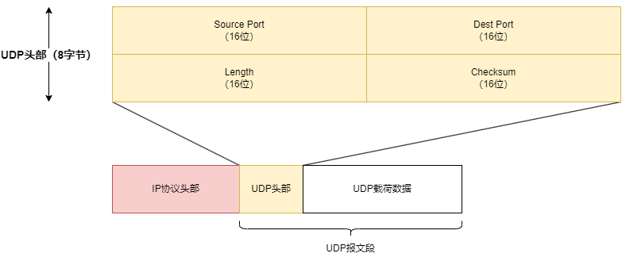

- [udp报文结构](#udp报文结构)
- [最大udp数据报的长度](#最大udp数据报的长度)

# udp报文结构

- Source Port：源端口号。
- Dest Port：目的端口号。
- Length：UDP头部+UDP载荷总的长度。
- CheckSum：校验和。

# 最大udp数据报的长度

udp不是面向连接的传输层协议。它保留了消息边界，也就是每次程序发送的udp数据都会单独形成一个udp数据包进行发送，当udp数据报大小超过MTU的话，就会触发ip协议的分片功能。

理论上一个ipv4数据报的最大长度是65535字节，除去ip头部最少20字节，udp头部8字节，那么udp数据载荷最大65507字节。但在具体实现中一般会有限制，典型的udp数据报大小的默认值是8192字节或65535字节。

许多udp应用被设计为限制数据报大小在512字节，这使得ip数据报小于576字节。因为标准规定主机一定能够接收一个576字节的ip数据报。常用的dns和dhcp都是这样设置的。
