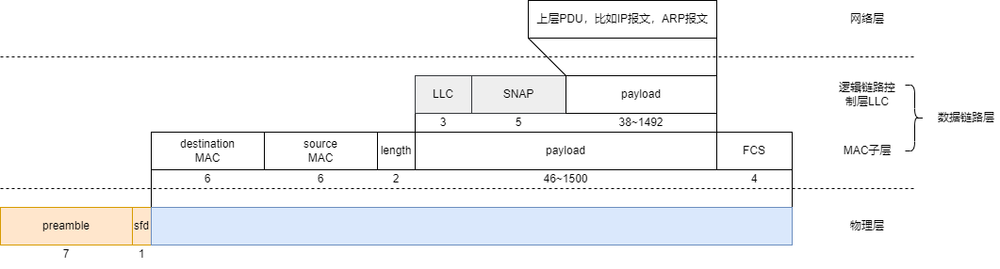

- [以太网协议](#以太网协议)
  - [以太帧格式](#以太帧格式)
    - [ethernet v2帧格式](#ethernet-v2帧格式)
    - [802.3帧格式](#8023帧格式)
  - [以太帧长度为什么是64到1518](#以太帧长度为什么是64到1518)
- [参考资料](#参考资料)

# 以太网协议

以太网协议是局域网的一种标准，被IEEE采纳定为802.3标准。

早期的10Mb/s以太网网络是共享总线型拓扑结构，使用CSMA/CD（Carrier Sense Multiple Access/Collision Detection）载波侦听多路访问/冲突检测的总线技术来进行通信。

CSMA/CD的原理是主机在通过网络线缆发送数据前先侦听信道是否空闲，若空闲则立即发送数据。在发送数据时，网卡边发送边继续侦听。若侦听到冲突，则立即停止发送数据，等待一段随机时间后再重新尝试发送或者超时报错。


现在的以太网为了实现更高的带宽，已经不使用竞争的总线机制了，而是通过交换机构建星型拓扑结构的网络。每个主机单独与交换机的一个接口相连接，实现高带宽，全双工的网络传输。现在以太网的速度可以达到千兆，万兆以上了。


## 以太帧格式

常见的以太帧格式有两种，一种是事实标准ethernet v2帧格式，另一种就是IEEE引入逻辑链路层LLC概念的802.3帧格式。两个格式是兼容的，可以通过判断`type/length`字段来分辨，当值大于1536则该字段表示类型（`type`），当值小于等于1500则该字段表示长度（`length`）。

### ethernet v2帧格式


在物理层中传输的时候以太帧前面都需要一串引导符。

- `preamble`：前同步码。
- `sfd`：帧开始界定符。

后面跟的才是真正的以太帧数据。

- `type`：协议类型，网卡用来分辨封装的是什么上层协议，然后再通知不同的协议模块来取走数据。`0x0800`为IP协议，`0x0806`为ARP协议，`0x86DD`为IPv6协议。
- `payload`：载荷数据，不足46字节时自动填充0，最大值1500也叫做MTU，最大传输单元。
- `FCS`：帧校验码，一般使用CRC校验算法。

### 802.3帧格式



可以看到`type`字段的含义变为了`length`，然后多了一个LLC子层，LLC的头部数据里面可以用来定义服务接入点，和上层协议类型等内容。

- `length`：载荷数据的长度，一定小于等于1500。

## 以太帧长度为什么是64到1518

最小长度64，是因为最开始的以太网是共享信道的，使用CSMA/CD冲突检测技术。对于任何一台主机A想要发送数据，如果发送过程中有另外的主机B也要发送数据。假设相隔最远的两台主机间信号传输要花费$\tau$的时间，那么主机A最少要等待$2\tau$的时间才能确保检测出冲突，然后再计算一下，就得出一个以太帧最少要64字节了。

至于为什么最大是1518，那是因为以太帧太小浪费带宽，太大时延又高。所以折中规定了1518。

而1518个字节，再减去一个以太帧中固定的参数，得到载荷数据的最大值就是1500，这个值就是MTU，这个值会影响网络的效率和连通性，很重要。可以通过`ip link show DEVICE`命令查看网卡的MTU。

```bash
[rc@localhost ~]$ ip link show ens33
2: ens33: <BROADCAST,MULTICAST,UP,LOWER_UP> mtu 1500 qdisc pfifo_fast state UP mode DEFAULT group default qlen 1000
    link/ether 00:0c:29:26:36:6b brd ff:ff:ff:ff:ff:ff
```

# 参考资料

- [ethernet v2和802.3帧格式区别-车小胖知乎回答](https://www.zhihu.com/question/52874615/answer/466673043)
- [以太帧类型](https://blog.csdn.net/xiao_ping_gai/article/details/117621882)
- [车小胖谈网络：Ethernet Frame](https://zhuanlan.zhihu.com/p/21318925)
